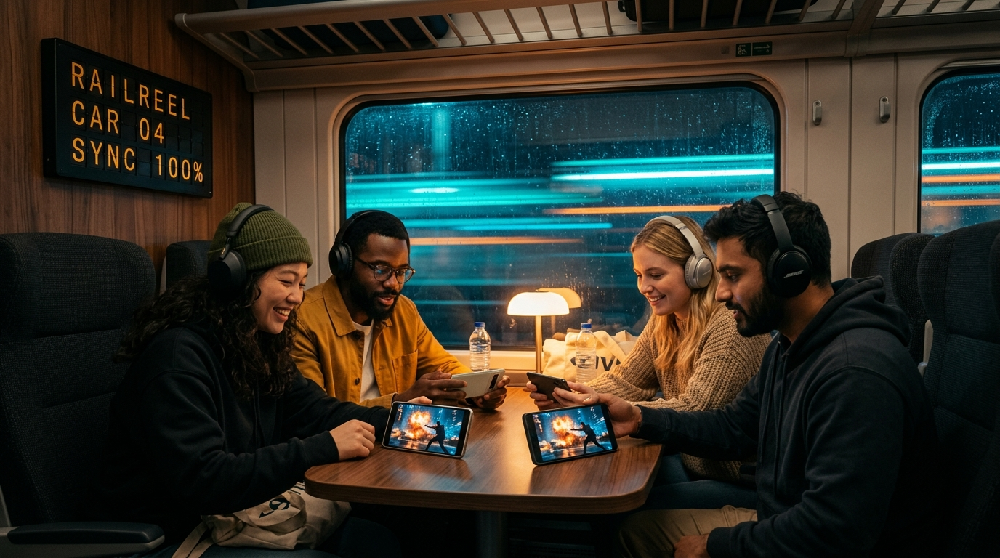

<div align="center">



# 🎬 RailReel

**A private movie theater that travels with you.**

Watch a movie together, tightly in sync, on everyone's own phone — with **no internet**.

[](https://github.com/kvm404/railreel/releases/tag/v0.1.0)
[](https://github.com/kvm404/railreel/releases/download/v0.1.0/RailReel-v0.1.0.apk)
[](LICENSE)

</div>

---

## The idea

You're on a train with friends and want to watch a movie together. The network is too weak to
stream, and crowding around one phone (speaker on, annoying the whole carriage) is miserable.

**RailReel** fixes that. One person (the **host**) has the movie on their phone. Everyone else
joins over the host's **WiFi hotspot** — no internet needed. The movie is shared to each phone
and played back **in sync**, so everyone watches on their own screen and headphones, with live
reactions, subtitles, and chat. A private cinema that fits in your pocket.

## How it works

1. **Host** picks a movie (and optional `.srt` subtitles) and starts a session.
2. Friends on the host's hotspot **tap to join**; the host **approves** them.
3. The movie distributes to each phone over the native local HTTP data plane.
4. **Synchronized playback** — the host controls transport; participants can send playback requests; everyone stays locked together.
5. **Floating emoji reactions + group chat + synchronized subtitles** while you watch.
6. **One-tap storage cleanup** — reclaim device storage immediately once the movie ends.

> The key trick: RailReel doesn't stream video in real time. It distributes the file once, then
> keeps everyone in sync by aligning **clocks**, not by streaming pixels. That's what makes it
> work on a weak hotspot without melting the host's battery. See
> [`docs/architecture.md`](docs/architecture.md).

## Status

🚀 **v0.1.0 Released**. Download the pre-built release APK from [GitHub Releases](https://github.com/kvm404/railreel/releases/tag/v0.1.0). See the roadmap in [`docs/prd/railreel-v1.md`](docs/prd/railreel-v1.md).

## Tech

- **React Native + Expo** (custom dev client), TypeScript, **Android**.
- **bun** workspaces monorepo.
- Local **mDNS** discovery, embedded **HTTP** (range) + **WebSocket** servers on the host.
- Fully **offline** — no backend, no accounts, no cloud.

## Development

```bash
bun install
bun run mobile:start      # start the Expo dev server (custom dev client)
bun run mobile:android    # build & run on a connected Android device
bun run lint && bun run test
```

A **custom dev client** is required (native modules for discovery + local servers); Expo Go
won't work. Device-testing setup is documented as we build.

## Constraints

- Works only with **DRM-free** files the host owns (encrypted store downloads can't be shared).
- Designed for groups of **4–6**.

---

<div align="center">
Built as an open-source portfolio project. Born on a train. 🚆
</div>
